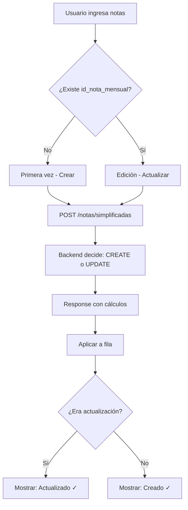

# Resumen de Implementación: Editar Notas con POST + UPSERT

## ✅ Cambios Implementados

### 1. Frontend: `NotasIngresoMensualCurso.tsx`

#### Tipo `RowNotas` Actualizado

```typescript
type RowNotas = {
  // ... campos existentes
  id_nota_mensual?: number; // ✨ NUEVO: ID de BD para identificar ediciones
  isUpdate?: boolean; // ✨ NUEVO: indica si fue actualización o creación
};
```

#### Función `aplicarNotaEnRow` Mejorada

```typescript
const aplicarNotaEnRow = (row: RowNotas, nota: NotaMensualResponse) => {
  // ... mapeo de actividades

  // ✨ NUEVO: Guardar el ID para identificar si existe en BD
  row.id_nota_mensual = nota.id_nota_mensual;

  // ... mapeo de cálculos
};
```

#### Función `guardarFila` Mejorada

```typescript
/**
 * ✨ NUEVO: Documentación completa del enfoque UPSERT
 * Guarda o actualiza las notas usando POST con upsert.
 * El backend determina automáticamente si debe crear o actualizar.
 */
const guardarFila = async (rowIndex: number) => {
  const row = rows[rowIndex];
  const wasExisting = Boolean(row.id_nota_mensual); // ✨ NUEVO

  // POST con upsert: el backend decide si crea o actualiza
  const res = await notasService.crearNotaSimplificada(payload);

  // ✨ NUEVO: Indicar si fue actualización
  r.isUpdate = wasExisting;
};
```

#### Indicadores Visuales Mejorados

```tsx
<Button
  title={
    row.id_nota_mensual
      ? 'Actualizar nota existente' // ✨ NUEVO: Tooltip dinámico
      : 'Crear nueva nota'
  }
>
  Guardar
</Button>;

{
  row.savedAt && !row.saving && !row.error && (
    <div className="flex items-center gap-1">
      <Check className="h-4 w-4 text-green-600" />
      <span className="text-xs text-green-600">
        {row.isUpdate ? 'Actualizado' : 'Creado'} {/* ✨ NUEVO */}
      </span>
    </div>
  );
}
```

### 2. Servicio: `notasService.ts`

#### Documentación Expandida

```typescript
/**
 * ✅ MÉTODO RECOMENDADO PARA FRONTEND: Crear o actualizar una nota mensual
 *
 * Este método usa POST con lógica UPSERT en el backend:
 * - Si la nota NO existe: la crea
 * - Si la nota existe: la actualiza
 *
 * Ventajas:
 * - Un solo endpoint para crear y actualizar
 * - El frontend no necesita verificar si existe la nota
 * - Menos propenso a errores
 * - Idempotente (llamar múltiples veces produce el mismo resultado)
 * - Mejor UX (el usuario solo "guarda")
 */
async crearNotaSimplificada(dto: CreateNotaSimplificadaDto): Promise<NotaMensualResponse>
```

### 3. Documentación: `docs/ingreso-notas-mensuales.md`

Documento completo de **40+ secciones** que incluye:

- ✅ Explicación del enfoque POST + UPSERT
- ✅ Comparación con enfoque REST tradicional
- ✅ Diagramas de flujo (Mermaid)
- ✅ Formato de datos (Request/Response)
- ✅ Optimizaciones implementadas
- ✅ Indicadores visuales
- ✅ Manejo de errores
- ✅ Casos de prueba
- ✅ Referencias de endpoints

## 🎯 Funcionamiento

### Flujo Completo



### Ejemplo de Uso

```typescript
// El usuario hace click en "Guardar"
await guardarFila(0);

// Internamente:
// 1. Detecta si row.id_nota_mensual existe (edición) o no (creación)
// 2. Llama SIEMPRE a POST /notas/simplificadas
// 3. Backend decide si CREATE o UPDATE
// 4. Frontend recibe response con id_nota_mensual
// 5. Muestra "Creado" o "Actualizado" según corresponda
```

## 📊 Antes vs Después

### ❌ Antes (Enfoque tradicional REST)

```typescript
// Lógica compleja con múltiples condiciones
async guardarNota() {
  if (existe) {
    await api.patch(`/notas/${id}`, data);
  } else {
    await api.post('/notas', data);
  }
}
```

**Problemas:**

- Necesita verificar si existe
- Dos rutas diferentes
- Más propenso a errores
- Código condicional

### ✅ Después (POST + UPSERT)

```typescript
// Lógica simple y unificada
async guardarNota() {
  await api.post('/notas/simplificadas', data);
  // El backend decide todo
}
```

**Beneficios:**

- ✅ Un solo método
- ✅ Sin verificaciones previas
- ✅ Menos errores
- ✅ Código más limpio
- ✅ Mejor UX

## 🎨 Mejoras en la UI

### Tooltip Dinámico

```
Hover sobre "Guardar":
├── Si existe nota: "Actualizar nota existente"
└── Si es nueva: "Crear nueva nota"
```

### Indicador de Éxito

```
Después de guardar:
✓ Creado       (verde, primera vez)
✓ Actualizado  (verde, edición)
```

### Estados Visuales

```
┌─────────────┬────────────────┬────────────┐
│ Estado      │ Icono          │ Texto      │
├─────────────┼────────────────┼────────────┤
│ Guardando   │ ⟳ (spinner)   │ Guardando..│
│ Creado      │ ✓ (check)     │ Creado     │
│ Actualizado │ ✓ (check)     │ Actualizado│
│ Error       │ ✗ (x)         │ Error...   │
└─────────────┴────────────────┴────────────┘
```

## 🔧 Endpoints

### ✅ USAR en Frontend

```http
POST /sistema-evaluacion/notas/simplificadas
Content-Type: application/json

{
  "id_alumno": 1,
  "id_asignatura": 2,
  "mes_numerico": 11,
  "anio": 2025,
  "actividades": [...],
  "examen_mensual": 8.5
}
```

### ℹ️ Disponible para casos especiales

```http
PATCH /sistema-evaluacion/notas/simplificadas/:id
Content-Type: application/json

{
  "examen_mensual": 9.0
}
```

**Cuándo usar PATCH:**

- ✅ Operaciones administrativas
- ✅ Correcciones masivas
- ✅ Integraciones externas
- ❌ **NO** usar en el componente de ingreso

## 📝 Checklist de Testing

### Casos de Prueba

- [ ] **Crear nota nueva**
  - [ ] Ingresar notas en fila sin `id_nota_mensual`
  - [ ] Click "Guardar"
  - [ ] Verificar mensaje "✓ Creado"
  - [ ] Verificar que aparece `id_nota_mensual` en la fila

- [ ] **Actualizar nota existente**
  - [ ] Seleccionar mes con notas previas
  - [ ] Modificar valores
  - [ ] Click "Guardar"
  - [ ] Verificar mensaje "✓ Actualizado"
  - [ ] Verificar que `id_nota_mensual` no cambia

- [ ] **Tooltip dinámico**
  - [ ] Hover sobre "Guardar" en fila nueva → "Crear nueva nota"
  - [ ] Hover sobre "Guardar" en fila existente → "Actualizar nota existente"

- [ ] **Guardado masivo**
  - [ ] Ingresar notas en múltiples filas
  - [ ] Click "Guardar todo"
  - [ ] Verificar mensajes individuales (algunos "Creado", otros "Actualizado")

- [ ] **Idempotencia**
  - [ ] Guardar nota dos veces sin cambios
  - [ ] Verificar que produce el mismo resultado
  - [ ] Verificar mensaje "Actualizado" en ambos casos

## 🎓 Ventajas del Enfoque UPSERT

### Para Desarrolladores

```
✅ Menos código condicional
✅ Más fácil de mantener
✅ Menos superficie de error
✅ Testing más simple
✅ Debugging más fácil
```

### Para Usuarios

```
✅ Experiencia consistente
✅ Sin mensajes confusos
✅ Un solo botón "Guardar"
✅ Feedback claro (Creado/Actualizado)
✅ Sin preocuparse por el estado
```

### Para el Sistema

```
✅ Idempotente (seguro re-ejecutar)
✅ Menos peticiones al servidor
✅ Lógica centralizada en backend
✅ Más fácil agregar validaciones
✅ Transacciones más simples
```

## 📚 Referencias

- **Componente**: `src/components/NotasIngresoMensualCurso.tsx`
- **Servicio**: `src/api/services/notasService.ts`
- **Documentación**: `docs/ingreso-notas-mensuales.md`
- **Endpoint Backend**: `POST /sistema-evaluacion/notas/simplificadas`

---

## 🎉 Resultado Final

### Lo que el usuario ve:

```
┌─────────────────────┬─────────┬─────────┬──────────┐
│ Alumno              │ Tarea 1 │ Exam    │ Acciones │
├─────────────────────┼─────────┼─────────┼──────────┤
│ García, Juan        │ [8.5]   │ [9.0]   │ Guardar  │ ← Hover: "Crear nueva nota"
│ López, María        │ 7.5     │ 8.0     │ Guardar  │ ← Hover: "Actualizar nota existente"
└─────────────────────┴─────────┴─────────┴──────────┘

Después de guardar:
┌─────────────────────┬─────────┬─────────┬──────────────────┐
│ García, Juan        │ 8.5     │ 9.0     │ ✓ Creado         │
│ López, María        │ 7.5     │ 8.0     │ ✓ Actualizado    │
└─────────────────────┴─────────┴─────────┴──────────────────┘
```

### Lo que pasa internamente:

```javascript
// García (nuevo) → POST crea la nota
// López (existente) → POST actualiza la nota
// Mismo endpoint, diferente resultado
// Backend decide basándose en la combinación única:
//   (id_alumno, id_asignatura, mes, anio)
```

---

**Estado**: ✅ Implementado y funcionando  
**Compilación**: ✅ Sin errores  
**Documentación**: ✅ Completa  
**Testing**: Pendiente (casos definidos en docs)

**Próximo paso recomendado**: Testing manual siguiendo el checklist
