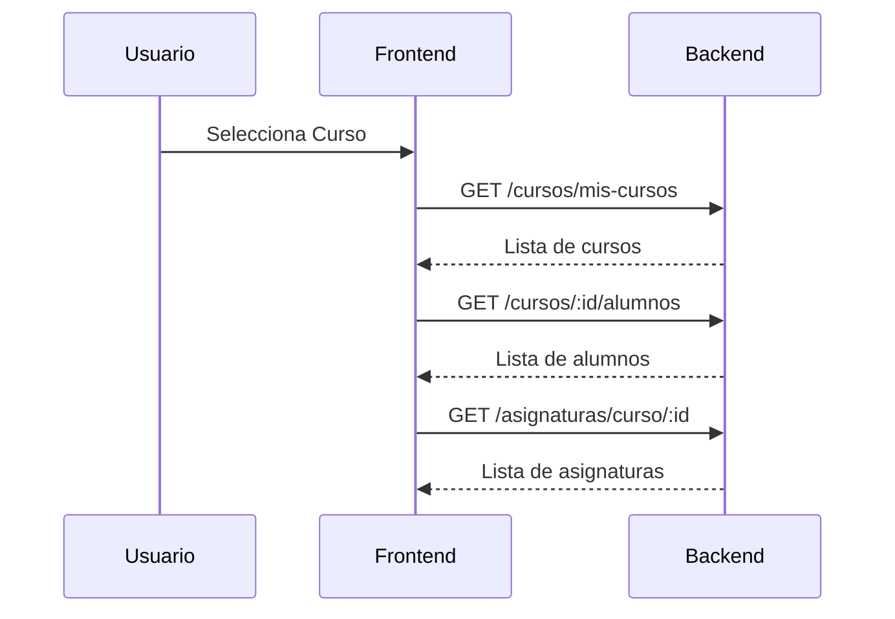
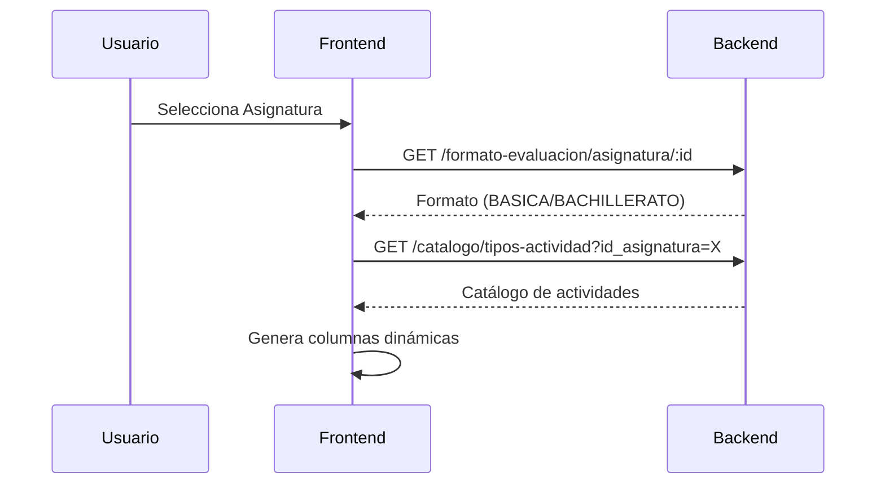
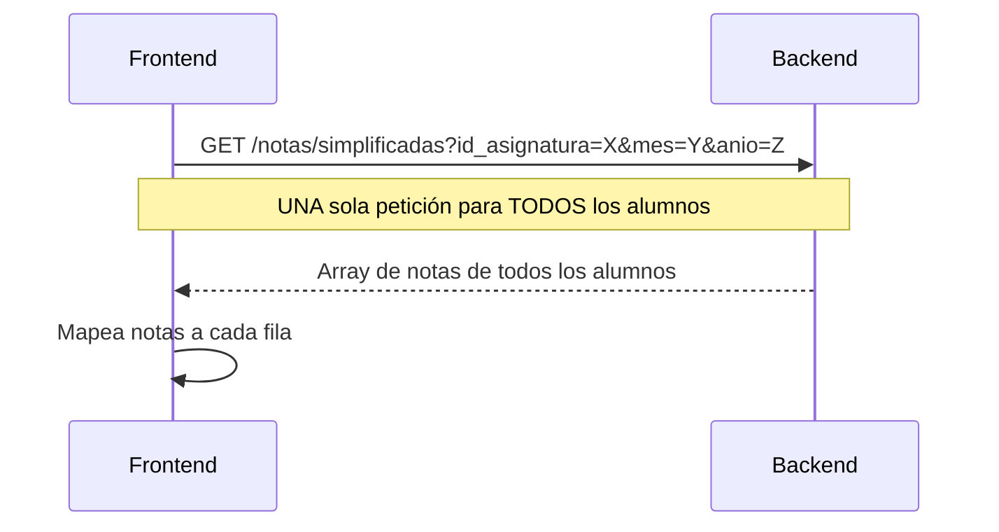
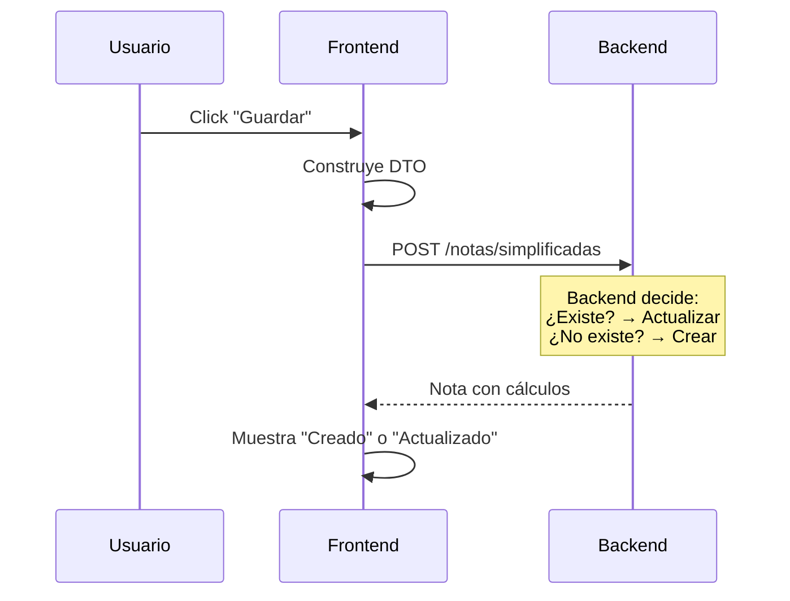

# Sistema de Ingreso de Notas Mensuales

## Visión General

El sistema permite a los orientadores ingresar y editar notas mensuales de evaluación para sus cursos asignados. El componente implementa una interfaz intuitiva que maneja tanto la creación como la actualización de notas usando un **enfoque unificado con POST + UPSERT**.

## Arquitectura

### Frontend

- **Componente**: `NotasIngresoMensualCurso.tsx`
- **Servicio**: `notasService.ts`
- **Ruta**: `/notas`

### Backend

- **Endpoint Principal**: `POST /sistema-evaluacion/notas/simplificadas`
- **Lógica**: UPSERT (crear si no existe, actualizar si existe)

## Enfoque de Guardado: POST con UPSERT ✅

### ¿Por qué POST con UPSERT?

Hemos optado por usar **un solo endpoint POST** que internamente decide si crear o actualizar, en lugar de usar POST para crear y PATCH para actualizar. Esto proporciona:

#### Ventajas

1. **Simplicidad**: Un solo método en el frontend (`crearNotaSimplificada`)
2. **Menos lógica condicional**: No necesitas verificar si la nota existe antes de guardar
3. **Menos propenso a errores**: No hay que gestionar diferentes rutas según el caso
4. **Idempotencia**: Llamar múltiples veces con los mismos datos produce el mismo resultado
5. **Mejor UX**: El usuario solo ve "Guardar", no necesita saber si es creación o actualización
6. **Código más limpio**: Menos código condicional, más mantenible

#### Comparación de Enfoques

```typescript
// ❌ Enfoque tradicional REST (complejo)
async guardarNota(nota) {
  // 1. Verificar si existe
  const existente = await api.get(`/notas/${id}`);

  if (existente) {
    // 2a. Actualizar con PATCH
    return await api.patch(`/notas/${id}`, nota);
  } else {
    // 2b. Crear con POST
    return await api.post('/notas', nota);
  }
}

// ✅ Enfoque UPSERT (simple)
async guardarNota(nota) {
  // Un solo POST, el backend decide
  return await api.post('/notas/simplificadas', nota);
}
```

### Implementación en el Frontend

```typescript
/**
 * Guarda o actualiza las notas de un alumno usando POST con upsert.
 * El backend determina automáticamente si debe crear o actualizar.
 */
const guardarFila = async (rowIndex: number) => {
  const row = rows[rowIndex];
  const wasExisting = Boolean(row.id_nota_mensual);

  try {
    // POST con upsert: el backend decide si crea o actualiza
    const res = await notasService.crearNotaSimplificada(payload);

    // Aplicar resultados y mostrar mensaje apropiado
    aplicarNotaEnRow(row, res);
    row.isUpdate = wasExisting; // "Actualizado" vs "Creado"
  } catch (err) {
    // Manejar errores
  }
};
```

### ¿Cuándo usar PATCH?

El endpoint `PATCH /sistema-evaluacion/notas/simplificadas/:id` sigue disponible para:

- ✅ Actualizaciones parciales por ID desde **otras partes del sistema**
- ✅ **Operaciones administrativas** o de corrección
- ✅ **APIs públicas** donde los consumidores esperan RESTful estricto
- ✅ Integraciones externas que requieren el ID explícito

**⚠️ No usar PATCH desde el componente de ingreso de notas** - usa siempre POST con upsert.

## Flujo de Datos

### 1. Carga Inicial



### 2. Configuración de Columnas



### 3. Carga de Notas Existentes (Optimizado)



### 4. Guardado con UPSERT



## Formato de Datos

### Request (DTO)

```typescript
interface CreateNotaSimplificadaDto {
  id_alumno: number;
  id_asignatura: number;
  mes: number; // 1-12
  anio: number; // 2025
  actividades: ActividadEvaluacion[];
  examen_mensual?: number; // Opcional
  examen_parcial?: number; // Opcional (Bachillerato)
}

interface ActividadEvaluacion {
  id_tipo_actividad: number;
  numero_actividad?: number; // null para actividades únicas
  nota: number; // 0-10
}
```

### Response

```typescript
interface NotaMensualResponse {
  id_nota_mensual: number; // ID en BD (para identificar ediciones)
  id_alumno: number;
  id_asignatura: number;
  mes_numerico: number;
  anio: number;
  trimestre: number;

  // Notas ingresadas
  actividades: ActividadDetalleResponse[];
  examen_mensual?: number;
  examen_parcial?: number;

  // Cálculos automáticos (BASICA)
  promedio_puro_actividades?: number; // Promedio simple
  promedio_70_actividades?: number; // Prom × 0.70
  promedio_30_examen?: number; // Exam × 0.30
  nota_mensual?: number; // Nota final del mes
  porcentaje_aporte?: number; // % según mes (28%, 27%, 45%)
  aporte_al_trimestre?: number; // Nota × % aporte

  // Metadata
  fecha_registro: string;
  fecha_actualizacion?: string;
}
```

## Indicadores Visuales

### Estados de Fila

1. **Sin guardar**: Fila con datos pero sin `id_nota_mensual`
2. **Guardando**: Spinner visible, botón deshabilitado
3. **Creado**: ✅ "Creado" (verde) - Primera vez guardado
4. **Actualizado**: ✅ "Actualizado" (verde) - Edición guardada
5. **Error**: Mensaje de error en rojo

### Tooltips

```typescript
title={
  row.id_nota_mensual
    ? 'Actualizar nota existente'
    : 'Crear nueva nota'
}
```

## Niveles Educativos

### Educación Básica (70/30)

**Columnas de entrada:**

- Tarea 1
- Revisión de libros y cuadernos
- Tarea 2
- Laboratorio escrito
- Examen Mensual

**Columnas calculadas:**

- Prom. Puro (promedio simple de actividades)
- Prom. 70% (promedio × 0.70)
- Exam. 30% (examen × 0.30)
- Nota Mensual (70% + 30%)
- Aporte Trim. (nota × % del mes)

### Bachillerato (Componentes Ponderados)

**Columnas de entrada:**

- Componentes dinámicos según asignatura
- Examen Parcial (opcional)
- Examen del Periodo (opcional)

**Columnas calculadas:**

- Prom. Puro
- Nota Mensual
- (Sin cálculos 70/30, usa ponderación por componentes)

## Optimizaciones Implementadas

### 1. Carga en Batch

**Antes:** N peticiones (una por alumno)

```typescript
// ❌ Ineficiente
for (const alumno of alumnos) {
  const nota = await cargarNota(alumno.id);
}
```

**Ahora:** 1 petición (todos los alumnos)

```typescript
// ✅ Eficiente
const todasLasNotas = await notasService.consultarNotasSimplificadas({
  id_asignatura: idAsignatura,
  mes: mesNum,
  anio: anio,
});
```

### 2. Mapeo de Actividades

Distingue correctamente entre:

- **Actividades únicas** (sin `numero_actividad`): Revisión de libros
- **Actividades múltiples** (con `numero_actividad`): Tarea 1, Tarea 2

```typescript
const a = nota.actividades?.find((x) => {
  if (c.numero_actividad === undefined) {
    // Actividad única: solo comparar tipo
    return x.id_tipo_actividad === c.id_tipo_actividad;
  } else {
    // Actividad múltiple: comparar tipo y número
    return (
      x.id_tipo_actividad === c.id_tipo_actividad &&
      x.numero_actividad === c.numero_actividad
    );
  }
});
```

## Validaciones

### Frontend

- Notas entre 0 y 10
- Al menos una nota ingresada por fila
- Asignatura y curso seleccionados

### Backend

- Validación de tipos de actividad vs asignatura
- Cálculos automáticos según nivel educativo
- Validación de permisos (orientador solo sus cursos)

## Manejo de Errores

```typescript
try {
  const res = await notasService.crearNotaSimplificada(payload);
  // Éxito: mostrar "Creado" o "Actualizado"
} catch (err) {
  // Error: mostrar mensaje en rojo
  row.error = err.message || 'Error al guardar';
}
```

### Errores Comunes

1. **404** al cargar notas → Tratado como lista vacía (normal para primer ingreso)
2. **400** al guardar → Validación fallida (mostrar mensaje específico)
3. **403** al cargar asignaturas → Fallback a endpoint público
4. **500** → Error del servidor (mostrar mensaje genérico)

## Acceso por Roles

### Orientador

- ✅ Ver solo sus cursos asignados
- ✅ Crear/editar notas de sus alumnos
- ❌ Ver cursos de otros orientadores

### Admin / P.A

- ✅ Ver todos los cursos
- ✅ Crear/editar notas de cualquier alumno
- ✅ Acceso a endpoints administrativos

## Testing

### Casos de Prueba Manuales

1. **Creación de nota nueva**
   - [ ] Seleccionar curso sin notas previas
   - [ ] Ingresar notas
   - [ ] Guardar
   - [ ] Verificar mensaje "Creado"

2. **Edición de nota existente**
   - [ ] Seleccionar curso con notas del mes
   - [ ] Verificar que se cargan las notas existentes
   - [ ] Modificar valores
   - [ ] Guardar
   - [ ] Verificar mensaje "Actualizado"

3. **Guardado masivo**
   - [ ] Ingresar notas para múltiples alumnos
   - [ ] Click "Guardar todo"
   - [ ] Verificar que todas las filas se guardan

4. **Validaciones**
   - [ ] Intentar ingresar nota > 10
   - [ ] Intentar ingresar nota < 0
   - [ ] Guardar fila sin notas
   - [ ] Verificar mensajes de error

5. **Cálculos (Básica)**
   - [ ] Ingresar 4 actividades + examen
   - [ ] Verificar Prom. Puro correcto
   - [ ] Verificar Prom. 70% = Prom × 0.70
   - [ ] Verificar Exam. 30% = Exam × 0.30
   - [ ] Verificar Nota Mensual = 70% + 30%

## Próximos Pasos (Opcional)

### Mejoras Pendientes

- [ ] **Debouncing** en inputs para evitar re-renders excesivos
- [ ] **React.memo** en componentes de fila
- [ ] **Paginación** para cursos con >50 alumnos
- [ ] **Tests unitarios** para cálculos
- [ ] **Tests E2E** con Playwright
- [ ] **Exportar a Excel** las notas del mes
- [ ] **Comparación visual** con mes anterior

### Refactoring Opcional

- [ ] Extraer tipos a `src/types/evaluacion.ts`
- [ ] Crear hook `useNotasMensuales` para lógica de estado
- [ ] Separar componente `TablaNotas` del componente principal
- [ ] Crear servicio específico `notasMensualesService.ts`

## Referencias

### Endpoints Relacionados

```typescript
// Creación/Actualización (RECOMENDADO para frontend)
POST /sistema-evaluacion/notas/simplificadas

// Consulta con filtros
GET /sistema-evaluacion/notas/simplificadas
  ?id_asignatura=X&mes=Y&anio=Z&id_alumno=W

// Catálogo de actividades
GET /sistema-evaluacion/catalogo/tipos-actividad
  ?id_asignatura=X

// Formato de evaluación
GET /sistema-evaluacion/formato-evaluacion/asignatura/:id

// Actualización por ID (solo para casos especiales)
PATCH /sistema-evaluacion/notas/simplificadas/:id
```

### Archivos Relacionados

- `src/components/NotasIngresoMensualCurso.tsx` - Componente principal
- `src/api/services/notasService.ts` - Servicio de API
- `src/api/services/cursosService.ts` - Servicio de cursos
- `src/api/services/asignacionesService.ts` - Servicio de asignaturas
- `src/App.tsx` - Configuración de ruta

## Contacto y Soporte

Para preguntas sobre el sistema de evaluación, contactar al equipo de desarrollo backend.

---

**Última actualización**: 8 de noviembre de 2025  
**Versión del documento**: 1.0  
**Autor**: Equipo de Desarrollo CAI Frontend
